# Project Context

> **Auto-generated by [code-mapper](https://github.com/your-org/code-mapper).**  
> Read this file instead of scanning source files — it captures the full structure at a fraction of the token cost.
> `harness` · 37 files (python×37) · 35 classes · 95 functions · ~8,300 source lines

---
## File Structure

```
harness/
└── __init__.py
├── adapters/
  └── __init__.py
  └── base.py
  └── mr_adapter.py
  └── rl_adapter.py
  └── tf_adapter.py
  └── vb_adapter.py
└── allocator.py
└── backtest.py
└── cli.py
└── config.py
└── dashboard.py
└── executor.py
└── exit_sweep.py
└── health.py
└── llm_client.py
└── orchestrator.py
├── paper_trading/
  └── __init__.py
  └── db.py
  └── unified_reader.py
└── rag_client.py
└── reconciler.py
└── regime.py
└── regime_features.py
└── regime_model.py
└── reporter.py
└── rl_monitor.py
├── scripts/
  └── __init__.py
  └── train_regime.py
└── simulator.py
└── test_allocator_soft_blend.py
└── test_exit_enforcement.py
└── test_llm_summary.py
└── test_pnl_invariants.py
└── test_regime_features.py
└── test_regime_model.py
└── test_regime_safety.py
```

## Class Diagram

```mermaid
classDiagram
    class AllocationResult["«dataclass» AllocationResult"] {
        +total_capital: float
        +allocations: List
        +mode: str
        +get()
        +position_cap()
    }
    class AlpacaExecutor["AlpacaExecutor"] {
        +execute()
        +__init__()
    }
    class BaseAdapter["«abstract» BaseAdapter"] {
        +source: str
        +get_signal()
    }
    class CapitalAllocator["CapitalAllocator"] {
        +allocate()
        +allocate_for_regime()
        +__init__()
    }
    class Dashboard["«dataclass» Dashboard"] {
        +timestamp: str
        +health: Optional
        +alpaca: Optional
        +alpaca_error: Optional
    }
    class DashboardSection["«dataclass» DashboardSection"] {
        +title: str
        +rows: List
        +error: Optional
    }
    class HarnessBacktestReport["«dataclass» HarnessBacktestReport"] {
        +run_at: str
        +start_date: str
        +end_date: str
        +capital: float
    }
    class HarnessBacktester["HarnessBacktester"] {
        +run()
        +__init__()
    }
    class HarnessConfig["«dataclass» HarnessConfig"] {
        +total_capital: float
        +max_position_pct: float
        +max_strategy_pct: float
        +strategies: List
    }
    class HarnessSignal["«dataclass» HarnessSignal"] {
        +ticker: str
        +timestamp: datetime
        +action: str
        +confidence: float
        +is_actionable()
    }
    class HarnessSimulator["HarnessSimulator"] {
        +run_simulation()
        +__init__()
    }
    class HarnessTradingDB["HarnessTradingDB"] {
        +upsert_position()
        +update_position()
        +get_position()
        +get_all_positions()
        +close_position()
        +sync_from_alpaca()
        +record_trade()
        ...
    }
    class HealthChecker["HealthChecker"] {
        +run()
        +__init__()
    }
    class HealthReport["«dataclass» HealthReport"] {
        +timestamp: datetime
        +results: List
        +ok()
        +warnings()
        +failures()
    }
    class HealthResult["«dataclass» HealthResult"] {
        +name: str
        +status: str
        +message: str
        +latency_ms: Optional
    }
    class MRAdapter["MRAdapter"] {
        +__init__()
    }
    BaseAdapter <|-- MRAdapter : extends
    class Orchestrator["Orchestrator"] {
        +run()
        +__init__()
    }
    class PaperExecutor["PaperExecutor"] {
        +execute()
        +__init__()
    }
    class RAGClient["RAGClient"] {
        +health()
        +ingest()
        +ask()
        +summarize()
        +get_context()
        +is_up()
        +__init__()
    }
    class RLAdapter["RLAdapter"] {
        +invalidate_cache()
        +__init__()
    }
    BaseAdapter <|-- RLAdapter : extends
    class RLModelStatus["«dataclass» RLModelStatus"] {
        +ticker: str
        +model_exists: bool
        +backtest_exists: bool
        +latest_episode_sharpe: Optional
    }
    class ReconciledSignal["«dataclass» ReconciledSignal"] {
        +ticker: str
        +timestamp: datetime
        +action: str
        +confidence: float
    }
    class ReconciliationModeResult["«dataclass» ReconciliationModeResult"] {
        +mode: str
        +tickers_acted: int
        +tickers_held: int
        +conflicts_blocked: int
    }
    class Regime["Regime"] {
    }
    class RegimeClassifier["RegimeClassifier"] {
        +load()
        +predict_proba()
        +predict()
        +__init__()
    }
    class Reporter["Reporter"] {
        +print_signal_summary()
        +print_positions()
        +print_recent_trades()
        +print_strategy_comparison()
        +print_full_report()
        +summarize_run()
        +enrich_with_context()
        ...
    }
    class SafetyGate["SafetyGate"] {
        +MAX_TRADE_PCT: float
        +check()
        +__init__()
    }
    class SignalReconciler["SignalReconciler"] {
        +reconcile_all()
        +reconcile()
        +__init__()
    }
    class StrategyAllocation["«dataclass» StrategyAllocation"] {
        +strategy: str
        +capital: float
        +weight: float
        +sharpe: Optional
    }
    class StrategyBacktestResult["«dataclass» StrategyBacktestResult"] {
        +strategy: str
        +tickers: List
        +total_return: float
        +cagr: float
    }
    class TFAdapter["TFAdapter"] {
        +__init__()
    }
    BaseAdapter <|-- TFAdapter : extends
    class UnifiedPosition["«dataclass» UnifiedPosition"] {
        +ticker: str
        +strategy: str
        +shares: float
        +avg_cost: float
    }
    class UnifiedTrade["«dataclass» UnifiedTrade"] {
        +ticker: str
        +strategy: str
        +action: str
        +shares: float
    }
    class VBAdapter["VBAdapter"] {
        +__init__()
    }
    BaseAdapter <|-- VBAdapter : extends
    class _SafeStreamHandler["_SafeStreamHandler"] {
        +flush()
    }
```



## Module Dependencies

```mermaid
graph TD
    allocator --> config
    allocator --> regime
    dashboard --> config
    dashboard --> health
    dashboard --> rl_monitor
    dashboard --> unified_reader
    executor --> base
    executor --> config
    executor --> db
    executor --> reconciler
    exit_sweep --> base
    exit_sweep --> config
    exit_sweep --> db
    exit_sweep --> reconciler
    health --> config
    mr_adapter --> base
    orchestrator --> allocator
    orchestrator --> base
    orchestrator --> config
    orchestrator --> db
    orchestrator --> mr_adapter
    orchestrator --> regime
    orchestrator --> regime_features
    orchestrator --> rl_adapter
    orchestrator --> tf_adapter
    orchestrator --> vb_adapter
    reconciler --> base
    reconciler --> config
    regime_model --> regime
    regime_model --> regime_features
    reporter --> base
    reporter --> config
    reporter --> db
    reporter --> reconciler
    reporter --> unified_reader
    rl_adapter --> base
    rl_monitor --> config
    simulator --> allocator
    simulator --> config
    simulator --> orchestrator
    simulator --> reconciler
    simulator --> regime
    test_allocator_soft_blend --> allocator
    test_allocator_soft_blend --> config
    test_allocator_soft_blend --> regime
    test_exit_enforcement --> base
    test_exit_enforcement --> config
    test_exit_enforcement --> db
    test_exit_enforcement --> exit_sweep
    test_exit_enforcement --> orchestrator
    test_exit_enforcement --> reconciler
    test_pnl_invariants --> base
    test_pnl_invariants --> config
    test_pnl_invariants --> db
    test_pnl_invariants --> executor
    test_pnl_invariants --> exit_sweep
    test_pnl_invariants --> reconciler
    test_regime_features --> regime_features
    test_regime_model --> regime
    test_regime_model --> regime_features
    test_regime_model --> regime_model
    test_regime_safety --> regime
    tf_adapter --> base
    train_regime --> regime
    train_regime --> regime_features
    train_regime --> regime_model
    vb_adapter --> base
```



## Symbol Index


**`adapters\base.py`** `python`
> Base adapter interface and HarnessSignal dataclass.
- `«dataclass» class HarnessSignal`  — Unified signal schema across all strategies.
  methods: `is_actionable`
- `«abstract» class BaseAdapter(ABC)`  — Abstract base for strategy adapters.
  methods: `get_signal`

**`adapters\mr_adapter.py`** `python`
> Mean Reversion adapter — wraps mean_reversion.signals.generator.
- `class MRAdapter(BaseAdapter)`  — Wraps the Mean Reversion strategy signal generator.

**`adapters\rl_adapter.py`** `python`
> RL Strategy adapter — wraps rl_strategy.signals.generator.
- `class RLAdapter(BaseAdapter)`  — Wraps the RL strategy signal generator.
  methods: `invalidate_cache`

**`adapters\tf_adapter.py`** `python`
> Trend Following adapter — wraps trend_following.signals.generator.
- `class TFAdapter(BaseAdapter)`  — Wraps the Trend Following strategy signal generator.

**`adapters\vb_adapter.py`** `python`
> Volatility Breakout adapter — wraps volatility_breakout.signals.generator.
- `class VBAdapter(BaseAdapter)`  — Wraps the Volatility Breakout strategy signal generator.

**`allocator.py`** `python`
> Capital allocator — distributes capital across strategies based on Sharpe.
- `«dataclass» class StrategyAllocation`
- `«dataclass» class AllocationResult`
  methods: `get`, `position_cap`
- `class CapitalAllocator`  — Allocates harness capital across strategies.
  methods: `allocate`, `allocate_for_regime`

**`backtest.py`** `python`
> Harness cross-strategy backtester.
- `«dataclass» class StrategyBacktestResult`
- `«dataclass» class ReconciliationModeResult`
- `«dataclass» class HarnessBacktestReport`
- `class HarnessBacktester`  — Runs per-strategy backtests and compares all reconciliation modes.
  methods: `run`

**`cli.py`** `python`
> Harness CLI — unified entry point for the trading platform.
- `class _SafeStreamHandler(StreamHandler)`  — StreamHandler that tolerates flush errors on non-standard stdout wrappers.
  methods: `flush`
- `def cmd_status(args) → None`  — Health check all services, models, and data.
- `def cmd_dashboard(args) → None`  — Unified dashboard: health, Alpaca, positions, trades, data, RL models, regime.
- `def cmd_data_collection(args) → None`  — Collect sentiment + risk snapshots for every ticker in the union universe.
- `def cmd_ask(args) → None`  — Query the RAG market-intelligence layer with a free-text question.
- `def cmd_comprehensive(args) → None`  — Run comprehensive deep-dive analysis on one or more tickers.
- `def cmd_signal_generation(args) → None`  — Full signal cycle: collect → reconcile → allocate → execute → report.
- `def cmd_report(args) → None`  — Print unified P&L, positions, recent trades, and strategy comparison.
- `def cmd_positions(args) → None`  — Show all open positions across all strategy DBs.
- `def cmd_schedule(args) → None`  — Register both Task Scheduler jobs on Windows:
- `def cmd_data(args) → None`  — Trigger market data pipeline refresh (incremental parquet update).
- `def cmd_train(args) → None`  — Retrain RL models — all tickers or a single one.
- `def cmd_retrain_check(args) → None`  — Check all RL models for rolling Sharpe degradation; retrain if needed.
- `def cmd_logs(args) → None`  — Tail and aggregate recent log lines from all harness log files.
- `def cmd_backtest(args) → None`  — Run per-strategy backtests and compare all reconciliation modes.
- `def main()`

**`config.py`** `python`
> Harness configuration.
- `«dataclass» class HarnessConfig`  — Master configuration for the trading harness.
- `def get_config() → HarnessConfig`  — Return (and lazily build) the singleton HarnessConfig.

**`dashboard.py`** `python`
> Unified health + positions + data dashboard for the trading harness.
- `«dataclass» class DashboardSection`
- `«dataclass» class Dashboard`
- `def build_dashboard(cfg: Optional, include_health: bool, include_alpaca: bool, include_positions: bool) → Dashboard`  — Build a unified dashboard object from all available sources.
- `def print_dashboard(dashboard: Dashboard) → None`  — Print a formatted dashboard to stdout.
- `def save_dashboard(dashboard: Dashboard, cfg: Optional) → Path`  — Serialize the dashboard to ``daily_results/dashboard_YYYYMMDD.json``.

**`executor.py`** `python`
> Trade executor — routes reconciled signals to paper or live execution.
- `class SafetyGate`  — Pre-trade safety checks for live Alpaca execution.
  methods: `check`
- `class PaperExecutor`  — Records trades to harness_trades.db AND mirrors them to Alpaca paper trading acc
  methods: `execute`
- `class AlpacaExecutor`  — Routes orders to Alpaca via trading_core.AlpacaBroker (live mode).
  methods: `execute`

**`exit_sweep.py`** `python`
> Exit-sweep — enforces per-position stop-loss and max-hold-days regardless of
- `def sweep_exits(reconciled: Dict, raw_signals: Dict, cfg: Optional) → Dict`  — Force a SELL for any open harness position whose stop or hold horizon is breache

**`health.py`** `python`
> Pre-flight health checker for the trading harness.
- `«dataclass» class HealthResult`
- `«dataclass» class HealthReport`
  methods: `ok`, `warnings`, `failures`
- `class HealthChecker`  — Validates all harness dependencies before running.
  methods: `run`
- `def print_health_report(report: HealthReport) → None`  — Print health report in a formatted table.

**`llm_client.py`** `python`
> Thin LLM client for A2 run summaries.
- `def call_llm(prompt: str, provider: str, model: str, base_url: str) → Optional`  — Call the configured LLM and return the response text.

**`orchestrator.py`** `python`
> Signal orchestrator — collects signals from all strategies in parallel.
- `class Orchestrator`  — Collects signals from all enabled strategies, each on its own ticker universe.
  methods: `run`
- `def should_trip_bear_vol_circuit_breaker(spy_ohlcv, bear_vol_threshold: float) → tuple[bool, Optional[str]]`  — Return (tripped, reason) for the bear+high-vol circuit breaker (§ 10 S4).
- `def apply_circuit_breaker(results: Dict) → int`  — Demote all BUY/SHORT signals to HOLD in place; SELL/COVER signals are untouched.

**`paper_trading\db.py`** `python`
> Unified harness paper trading database.
- `class HarnessTradingDB`  — Interface to the unified harness paper trading database.
  methods: `upsert_position`, `update_position`, `get_position`, `get_all_positions`, `close_position`, `sync_from_alpaca`, `record_trade`, `get_trades`, +3 more
- `def init_db(db_path: Optional) → None`  — Create tables if they don't exist.
- `def save_signal_log(signals: Dict, regime: Optional, regime_features: Optional, db_path: Optional) → None`  — Persist reconciled signal feature vectors to signal_log for A3 meta-labeler trai
- `def save_run_summary(positions_opened: int, positions_closed: int, stops_triggered: int, holds_expired: int) → None`  — Persist per-run accumulation/observability counters (§ 10 I3).
- `def save_regime_log(regime: str, allocation_mode: str, allocations: List, db_path: Optional) → None`  — Persist a regime + allocation snapshot to regime_log table.

**`paper_trading\unified_reader.py`** `python`
> Unified DB reader — aggregates positions and trades across all strategy DBs.
- `«dataclass» class UnifiedPosition`
- `«dataclass» class UnifiedTrade`
- `def get_all_positions() → List`  — Read open positions from all strategy DBs plus the harness DB.
- `def get_all_trades(limit_per_db: int) → List`  — Read recent trades from all strategy DBs plus the harness DB.
- `def summary(days: Optional) → Dict`  — Return a dict summary of positions and P&L across all DBs.

**`rag_client.py`** `python`
> Thin HTTP client for the RAG service (rag_service :8200).
- `class RAGClient`  — HTTP client for rag_service endpoints.
  methods: `health`, `ingest`, `ask`, `summarize`, `get_context`, `is_up`

**`reconciler.py`** `python`
> Signal reconciler — resolves conflicting signals across strategies.
- `«dataclass» class ReconciledSignal`  — Final resolved signal for one ticker after reconciliation.
- `class SignalReconciler`  — Resolves per-ticker signal lists into a single ReconciledSignal.
  methods: `reconcile_all`, `reconcile`

**`regime.py`** `python`
> Market Regime Detector.
- `class Regime(str, Enum)`
- `def detect_regime(ohlcv: DataFrame, previous_regime: Optional, mode: str, model_path: Optional) → Regime`  — Classify the current market regime from a daily OHLCV DataFrame.
- `def get_regime_probs(ohlcv: DataFrame, model_path: Optional) → Optional`  — Return the probability dict {Regime: float} from the learned model.

**`regime_features.py`** `python`
> Feature engineering for the learned regime classifier (Phase 4, A4).
- `def compute_price_features(ohlcv: DataFrame) → DataFrame`  — Compute the price-technical feature columns for every row of a daily OHLC DataFr
- `def fetch_vix_live(fallback_realised_vol: Optional) → Optional`  — Fetch the latest VIX close via yfinance. Never raises.
- `def build_live_feature_vector(ohlcv: DataFrame) → Optional`  — Build a single feature dict for the *latest* row of live SPY OHLCV data.

**`regime_model.py`** `python`
> Learned regime classifier (Phase 4, A4).
- `class RegimeClassifier`  — Loads a trained XGBoost model and exposes predict / predict_proba.
  methods: `load`, `predict_proba`, `predict`
- `def save_model(model, model_path: str, metadata: Optional) → None`  — Persist a trained XGBoost model + a sidecar metadata JSON (feature order,

**`reporter.py`** `python`
> Unified reporter — formats signal summaries, positions, and strategy comparison.
- `class Reporter`  — Formats and prints all harness output.
  methods: `print_signal_summary`, `print_positions`, `print_recent_trades`, `print_strategy_comparison`, `print_full_report`, `summarize_run`, `enrich_with_context`, `save_run_report`

**`rl_monitor.py`** `python`
> RL model performance monitor and auto-retrain trigger.
- `«dataclass» class RLModelStatus`
- `def load_sharpe_history(cfg: HarnessConfig) → Dict`  — Load persisted Sharpe history: {ticker: [{at, mean_sharpe}, ...]}.
- `def save_sharpe_history(cfg: HarnessConfig, history: Dict) → None`  — Persist the Sharpe history JSON.
- `def record_backtest_sharpe(cfg: HarnessConfig, ticker: str, mean_sharpe: Optional, timestamp: Optional) → None`  — Append a backtest mean-Sharpe snapshot to the rolling history.
- `def run_retrain_check(cfg: Optional, min_sharpe: Optional, backtest_window: int, episode_window: int) → List`  — Check all (or selected) RL models and optionally retrain degraded ones.
- `def save_retrain_report(cfg: HarnessConfig, results: List, min_sharpe: float, auto_retrain: bool) → Path`  — Write a JSON report of the retrain check to ``results/retrain_check_YYYYMMDD.jso
- `def print_retrain_report(results: List, min_sharpe: float) → None`  — Print a formatted table of the retrain check results.

**`scripts\train_regime.py`** `python`
> Train the learned regime classifier (Phase 4, A4).
- `def load_labels_and_vix() → DataFrame`  — Load ^GSPC rows from the Kaggle dataset: date, mapped regime, confidence, vix.
- `def fetch_spy_ohlc_history(start: str, end: str) → DataFrame`  — Fetch real daily SPY OHLC via yfinance for the training date range.
- `def build_training_frame() → DataFrame`
- `def chronological_split(df: DataFrame, holdout_months: int)`
- `def train_model(train_df: DataFrame)`
- `def evaluate(model, encoder, holdout_df: DataFrame) → dict`
- `def main()`

**`simulator.py`** `python`
> Unified portfolio simulator for backtesting the harness.
- `class HarnessSimulator`  — Runs a full simulation of the harness logic (allocation + reconciliation) over t
  methods: `run_simulation`

**`test_allocator_soft_blend.py`** `python`
> Standalone test for Phase 4 A4: allocator.py soft-blend (regime_probs) support.
- `def check(name: str, condition: bool, detail: str)`
- `def test_default_hard_pick_unchanged()`
- `def test_soft_blend_active_when_enabled_and_probs_given()`
- `def test_soft_blend_disabled_when_no_probs_even_if_flag_true()`
- `def test_max_strategy_pct_cap_enforced_in_soft_blend()`

**`test_exit_enforcement.py`** `python`
> Behavioral smoke tests for Master Spec § 10 I1.
- `def check(name: str, condition: bool, detail: str)`
- `def test_bear_vol_breaker_trips_only_on_bear_and_high_vol()`
- `def test_circuit_breaker_demotes_buy_short_preserves_sell()`
- `def test_stop_breach_forces_sell_and_closes_position()`
- `def test_hold_expiry_forces_sell()`
- `def test_no_breach_leaves_reconciled_untouched()`

**`test_llm_summary.py`** `python`
> Tests for A2 — LLM Run Summary.
- `def check(name: str, condition: bool, detail: str) → None`
- `def test_call_llm_unknown_provider()`
- `def test_call_llm_ollama_connection_error()`
- `def test_call_llm_ollama_http_error()`
- `def test_call_llm_ollama_success()`
- `def test_call_llm_openai_missing_package()`
- `def test_summarize_run_mode_none()`
- `def test_summarize_run_llm_failure()`
- `def test_summarize_run_success()`
- `def test_save_run_report_no_summary_mode()`
- `def test_save_run_report_with_llm_summary()`
- `def test_save_run_report_regime_enrichment()`
- `def test_save_run_report_llm_failure_still_saves()`

**`test_pnl_invariants.py`** `python`
> P&L / exit invariant integration test (Master Spec § 10 I2).
- `def check(name: str, condition: bool, detail: str)`
- `def test_mini_signal_cycle_invariants()`
- `def test_dca_guard_blocks_add_to_underwater_position()`

**`test_regime_features.py`** `python`
> Standalone test for Phase 4 A4: regime_features.py.
- `def check(name: str, condition: bool, detail: str)`
- `def test_compute_price_features_shape()`
- `def test_flat_price_low_adx_low_vol()`
- `def test_uptrend_positive_momentum()`
- `def test_fetch_vix_live_fallback_on_failure(monkeypatch_module)`
- `def test_build_live_feature_vector_insufficient_history()`
- `def test_build_live_feature_vector_valid_shape()`

**`test_regime_model.py`** `python`
> Standalone test for Phase 4 A4: regime_model.py.
- `def check(name: str, condition: bool, detail: str)`
- `def test_missing_model_file()`
- `def test_corrupt_model_file()`
- `def test_no_model_path()`
- `def test_save_and_load_roundtrip()`

**`test_regime_safety.py`** `python`
> Standalone test for Phase 4 A4: safety regression tests for regime.py.
- `def check(name: str, condition: bool, detail: str)`
- `def test_default_mode_matches_explicit_heuristic()`
- `def test_model_mode_falls_back_when_file_missing()`
- `def test_model_mode_never_raises_on_corrupt_file()`
- `def test_previous_regime_hysteresis_unaffected()`
- `def test_unknown_mode_falls_back_to_heuristic_path()`